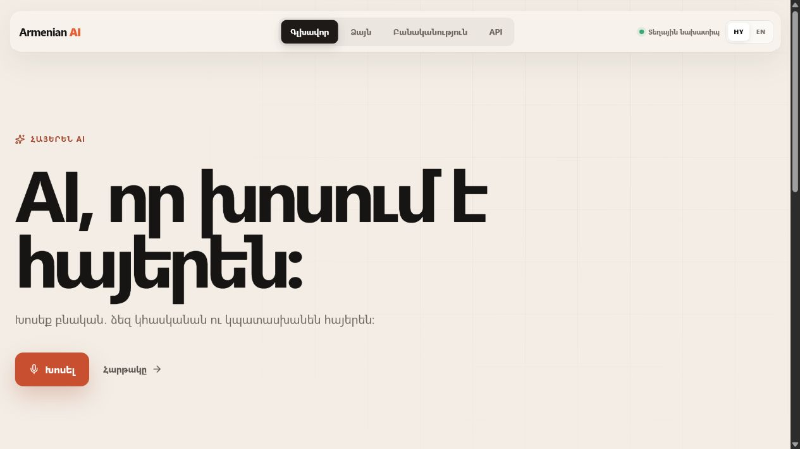
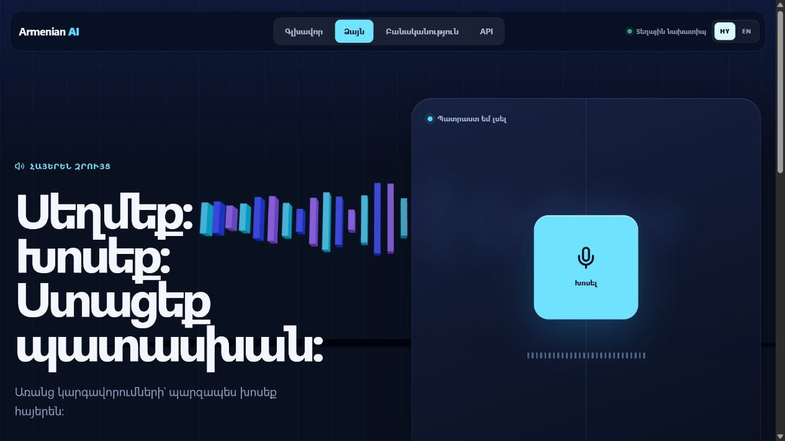
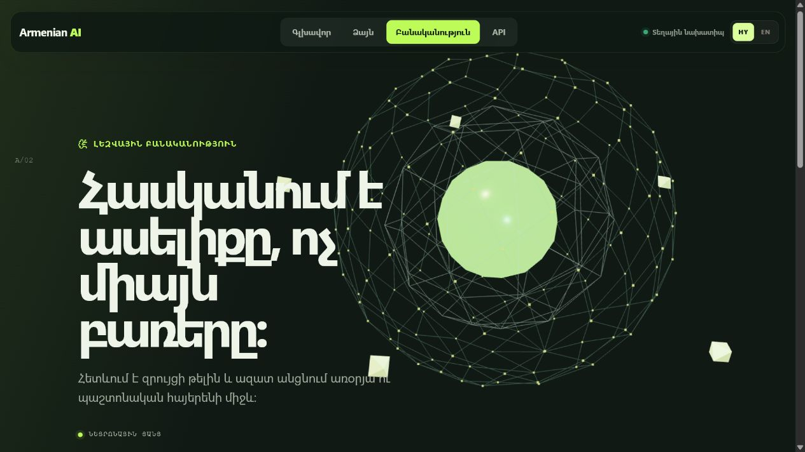
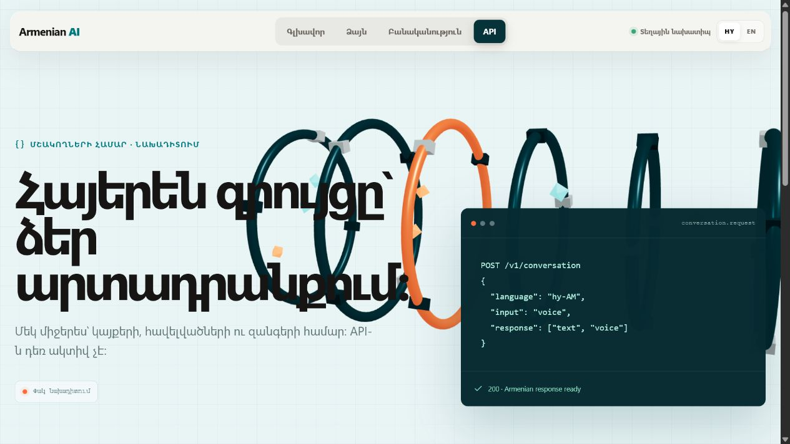
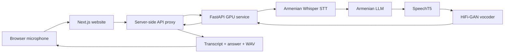

<div align="center">

# Armenian AI

### Հայերեն ձայնային օգնական · Armenian-first voice intelligence

[](https://github.com/armanvardanyan07/Armenian-Voice-Ai/actions/workflows/ci.yml)
[](https://armenian-ai-arman.netlify.app)


An end-to-end Armenian voice assistant that listens, understands, answers, and speaks in Armenian.

[Open the portfolio website](https://armenian-ai-arman.netlify.app) · [Explore the architecture](#architecture) · [Run locally](#run-locally)

</div>



> [!IMPORTANT]
> The Netlify website is online, but the separate GPU model server is currently stopped. The pages and interface work; Voice requests will not complete until the inference service is running again.

## Why this project exists

High-quality Armenian speech products are still difficult to build and expensive to host. Armenian AI demonstrates a complete voice experience built specifically around Armenian rather than translating through another language.

The project combines speech recognition, Armenian response generation, speech synthesis, a GPU API, browser recording, silence detection, and a responsive multilingual website.

## Product preview

| Voice conversation | Armenian intelligence |
|---|---|
|  |  |

| Developer experience | Product overview |
|---|---|
|  |  |

## Highlights

- Armenian speech-to-text with a fine-tuned Whisper Large v3 Turbo checkpoint
- Short natural Armenian answers produced by a 10B Armenian language model
- Armenian SpeechT5 synthesis with HiFi-GAN waveform generation
- Automatic recording stop after speech followed by 1.5 seconds of silence
- Replayable, copyable, clearable in-session conversation history
- Repetitive-transcript detection for common Whisper hallucination patterns
- Strict upload validation and a server-only GPU endpoint configuration
- Independent Home, Voice, AI, and API product routes
- Three route-specific real-time 3D scenes built with React Three Fiber
- Reproducible STT, LLM QLoRA, and TTS training entry points
- Netlify frontend separated from the heavyweight CUDA inference service

## Architecture



The browser never receives GPU credentials or a private model URL. Netlify forwards the recording from its server route to the configured inference service, validates the response, and returns a playable WAV data URL.

## What is original in Armenian AI

Armenian AI is the original system and product integration in this repository. It includes the architecture, FastAPI orchestration, audio conversion, validation, generation constraints, transcript-hallucination guard, Armenian TTS normalization, speaker conditioning, Next.js experience, recording lifecycle, automatic silence detection, history controls, tests, and deployment split.

The runtime starts from attributed third-party foundation checkpoints. This repository does not present those upstream weights as newly authored models. The included training recipes can produce project-specific adapters or checkpoints, which remain subject to their base-model and dataset licenses. See [MODEL_ATTRIBUTION.md](MODEL_ATTRIBUTION.md).

## Runtime model stack

| Stage | Model | Approximate size | Purpose |
|---|---|---:|---|
| STT | `Chillarmo/whisper-large-v3-turbo-armenian` | 0.8B parameters | Armenian audio transcription |
| LLM | `Gen2B/HyGPT-10b-it` | 10B parameters, 4-bit runtime | Armenian response generation |
| TTS | `Edmon02/speecht5_finetuned_voxpopuli_hy` | 0.1B parameters | Armenian acoustic generation |
| Vocoder | `microsoft/speecht5_hifigan` | Separate checkpoint | WAV reconstruction |
| Voice | `Matthijs/cmu-arctic-xvectors` | 512-value embedding | Speaker conditioning |

HyGPT has custom terms that require permission before offering the model as a third-party hosted service. The current public site is presented with the GPU service offline. Review [MODEL_ATTRIBUTION.md](MODEL_ATTRIBUTION.md) before enabling a public inference endpoint.

## Hardware requirements

The complete model pipeline is not lightweight and cannot run inside Netlify Functions or ordinary shared hosting.

| Resource | Development minimum | Recommended service |
|---|---:|---:|
| NVIDIA GPU | T4 with 16 GB VRAM | L4/A10 with 24 GB VRAM |
| System RAM | 24 GB | 32 GB or more |
| Persistent disk | 30 GB | 50 GB model cache |
| CUDA | Required by the current server | CUDA 12-compatible runtime |

The first server start downloads several gigabytes from Hugging Face and can take several minutes. Persistent model caching is strongly recommended on Lightning AI, RunPod, Vast.ai, AWS, or another GPU provider.

## Run locally

### Website only

```powershell
cd website
Copy-Item .env.example .env.local
npm install
npm run dev
```

Open `http://localhost:3000`. Without a GPU endpoint the visual experience works, while Voice correctly reports that the model service is unavailable.

### GPU inference service

Use a Linux CUDA machine with Python 3.11 or 3.12.

```bash
python -m venv .venv
source .venv/bin/activate
python -m pip install --upgrade pip
python -m pip install -r inference/requirements.txt
cp .env.example .env
python inference/server.py
```

Set the GPU service environment values from `.env.example`, then place its public HTTPS base URL in `website/.env.local`:

```dotenv
LIGHTNING_VOICE_API_URL=https://your-gpu-service.example.com
```

Never expose the GPU URL or tokens through a `NEXT_PUBLIC_` variable.

## API

### Health

```http
GET /health
```

```json
{"status":"ok"}
```

### Voice conversation

```bash
curl -X POST http://localhost:7860/voice-chat \
  -F "audio=@question.webm"
```

```json
{
  "transcript": "Բարև, ինչպե՞ս ես։",
  "answer": "Բարև, լավ եմ, շնորհակալություն։",
  "audio": {
    "mimeType": "audio/wav",
    "base64": "..."
  }
}
```

Recordings are limited to 10 MB. GPU execution is serialized to protect a single-card deployment from overlapping generations.

## Training

The repository contains training entry points for every learned stage:

```bash
python training/train_stt.py --dry-run
python training/train_llm_qlora.py --dry-run
python training/train_tts.py --dry-run
```

- `train_stt.py` fine-tunes Whisper on Common Voice 20 Armenian and evaluates WER.
- `train_llm_qlora.py` trains a compact Armenian instruction adapter on Qwen3-4B-Base.
- `train_tts.py` fine-tunes SpeechT5 on licensed Armenian text/audio pairs.

Dataset schemas, GPU expectations, smoke-test settings, and full commands are documented in [training/README.md](training/README.md).

## Tests

```powershell
python -m unittest discover -s tests -p "test_*.py"
python -m compileall inference training
cd website
npm run lint
npm test
```

The tests cover API shape, upload boundaries, repetitive-transcript rejection, training CLI configuration, silence timing, model-service configuration errors, response validation, route structure, and conversation history.

## Repository layout

```text
Armenian-Voice-Ai/
├── .github/workflows/ci.yml
├── docs/images/
├── inference/
│   ├── server.py
│   └── requirements.txt
├── training/
│   ├── train_stt.py
│   ├── train_llm_qlora.py
│   ├── train_tts.py
│   ├── requirements.txt
│   └── README.md
├── tests/
├── website/
├── .env.example
├── MODEL_ATTRIBUTION.md
├── LICENSE
└── README.md
```

## Deployment

The system intentionally uses two deployment targets:

1. **Netlify** hosts the Next.js portfolio and the secure proxy route.
2. **GPU infrastructure** hosts the Python model service and cached weights.

The frontend can be deployed independently. Voice becomes available only while the GPU service is running and `LIGHTNING_VOICE_API_URL` is configured in Netlify.

## Limitations

- Armenian accents, background noise, code-switching, names, and specialist vocabulary can reduce recognition accuracy.
- The assistant can generate incorrect information and should not be used for high-risk medical, legal, or financial decisions.
- SpeechT5 may omit or distort words outside its effective Armenian training distribution.
- The current API processes complete recordings and is not a streaming speech protocol.
- Public hosted use must follow every upstream model license.

## Author

Built by [Arman Vardanyan](https://github.com/armanvardanyan07) as an Armenian AI engineering and product-design project.

## License

Repository-authored source code is available under the [MIT License](LICENSE). Model weights and datasets are not included and retain their respective upstream licenses.
